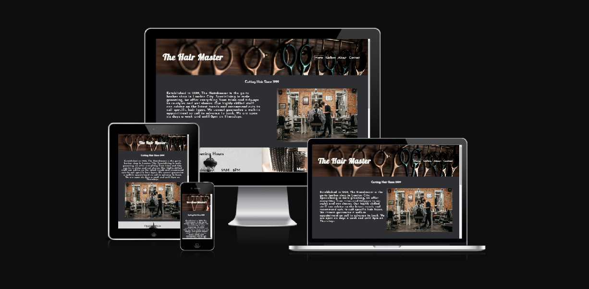
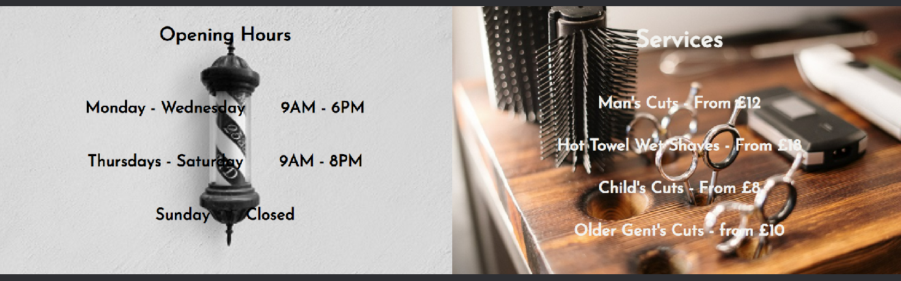

# The Hair Master

[Live webpage](https://r-moruju.github.io/CI_PP1_TH/index.html)

## Table of Content

1. [Project Goals](#project-goals)
    1. [User Goals](#user-goals)
    2. [Site Owner Goals](#site-owner-goals)
2. [User Experience](#user-experience)
    1. [Target Audience](#target-audience)
    2. [User Requrements and Expectations](#user-requrements-and-expectations)
    3. [User Stories](#user-stories)
3. [Design](#design)
    1. [Design Choices](#design-choices)
    2. [Colour](#colours)
    3. [Fonts](#fonts)
    4. [Structure](#structure)
    5. [Wireframes](#wireframes)
4. [Technologies Used](#technologies-used)
    1. [Languages](#languages)
    2. [Tools](#tools)
5. [Features](#features)
6. [Testing](#validation)
    1. [HTML Validation](#HTML-validation)
    2. [CSS Validation](#CSS-validation)
    3. [Accessibility](#accessibility)
    4. [Performance](#performance)
    5. [Device testing](#performing-tests-on-various-devices)
    6. [Browser compatibility](#browser-compatability)
    7. [Testing user stories](#testing-user-stories)
8. [Bugs](#Bugs)
9. [Deployment](#deployment)
10. [Credits](#credits)
11. [Acknowledgements](#acknowledgements)

## Project Goals 

### User Goals
- Finding a barber shop that offers a nice atmosphere and good services.
- See service prices and opening hours.
- Find information about the barber shop.
- Find the location of the barber shop

### Site Owner Goals
- Increase in the number of customers.
- Promote the bussines.
- Provide a way for new and existing customers to contact the buissnes.
- Provide essential information about the bussines to customers.

## User Experience

### Target Audience
- People looking for a place to get ther hair cut
- People looking for the latest haircut techniques
- People looking for current fashion in haircuts

### User Requrements and Expectations

- A simple and intuitive navigation system
- Quickly and easily find relevant information
- Links and functions that work as expected
- Good presentation and a visually appealing design regardless of screen size
- An easy way to contact the bussines
- Simple content that the user can skim read
- Accessibility

### User Stories

#### First-time User 
1. As a first time user, I want to know where the barber shop is located
2. As a first time user, I want to know the price range
3. As a first time user, I want to know more about the barber shop
4. As a first time user, I want to get a feel of what to expect at the barber shop

#### Returning User
5. As a returning user, I want to see examples of haircuts
6. As a returnign user, I want to know the opening times
7. As a returning user, I want to find a phone number to call for reservation
8. As a returning user, I want to see other customers reviews
9. As a returning user, I want to leave some comment, suggestion or message to the staff
10. As a returning user, I want to find the barber shop on social media
11. As a returning user, I want to get directions to the restaurant

#### Site Owner 
12. As the site owner, I want users to know what products we use
13. As the site owner, I want users to get to know the barber shop 
14. As the site owner, I want the users to be able to contact us

## Design

### Design Choices
Considering that the website will be mostly visited by men, a simple and straightforward design has been adopted, with little attention to details. Today's men have a full life and little time to waste, so they want to be able to cut their hair without wasting time and any distraction, while keeping up with fashion.

### Colour
For color the simple and masculine style was maintained. ColorSpace was used to generate shades starting from the dark navy color
which is also the colour theme of the actual barber shop.
 

### Fonts
Google fonts has been imported and "Josefin Sans" has been used for all the text inside the website with sans-serif as a fallback.
Only for the logo has been used "Lobster" with cursive as a fallback which match the shop outside sign.

### Structure
The page is structured in a well know, recognizable, user friendly, and easy to learn way. Upon arriving to the website the user sees a familiar type of navigation bar with the barber shop logo on the left side and the navigation links to the right. 
The website consists of four separate pages: 
- A homepage with a sections about opening hours, services, address and little description about the business
- An about page where more description is given and also what product are being used
- A gallery page with customers images and their reviews
- A contact page with a contact form

### Wireframes

Home

About

Gallery

Contact

## Technologies Used

### Languages
- HTML
- CSS

### Tools
- Git
- GitHub
- Gitpod
- Windows Paint
- Balsamiq
- Google Fonts
- ColorSpace
- Font Awsome

## Features
The page consists of four pages and eleven features

### Logo and Navigation Bar
- Featured on all four pages
- The navbar is fully responsive and includes
links to the Homepage, Gallery, About and Contact page
- It allows users to easily navigate the website
- The link for the page the user is currently on is highlighted 

### Busssines introduction on home page
- Provides a brief description of the barber shop
- Presents the user with an image of the shop
- User stories covered: 3, 4, 13

### Opening hours and Services
- Presents the weekly schedule with working hours
- Show available services
- Shows the price of each service
- User stories covered: 2, 6

### Address and Google map
- Clearly shows to the user the shop address 
- It also contains a Google map window that the user can use to get directions to the shop
- User stories covered: 1, 11

### Footer
- Provides external links to this shop social media profiles, where user can find more information about this shop
- These links, when clicked, open in new tabs or windows
- User stories covered: 10

### Gallery Page
- Contains images with satisfied customers
- Contains customer reviews
- Contains a youtube video about types of haircuts
- User stories covered: 3, 4, 5, 8, 13

### About Page
- Contains a more detailed description of the barber shop
- Provides details about the products used by the shop
- User stories covered: 3, 12, 13

### Contact Page
- It provide the shop telephone number for the user
- A contact form is present here that the user can use to leave a message and his contact details to be contacted by the shop
- User stories covered: 7, 9, 14

## Validation

### HTML Validation
The W3C Markup Validation Service was used to validate the HTML of the website. All pages pass with no errors no warnings to show.

Home

Gallery

About

Contact

### CSS Validation
The W3C Jigsaw CSS Validation Service was used to validate the CSS of the website.
When validating custom CSS it passes with no errors found, and just one warning associated with google fonts imported.

Style.css

### Accessibility
The WAVE WebAIM web accessibility evaluation tool was used to ensure the website met high accessibility standards. All pages pass with 0 errors.

Home

Gallery

About

Contact

### Performance 
Google Lighthouse in Google Chrome Developer Tools was used to test the performance of the website. 

Home

Gallery

About

Contact

### Performing tests on various devices 
The website was tested on the following devices:
- Lenovo Ideapad 5
- Samsung Galaxy Tab 8 Ultra
- iPhone 12
- Xiaomi Redmi Note 11 Pro

In addition, the website was tested using Google Chrome Developer Tools Device Toggeling option for all available device options.

### Browser compatability
The website was tested on the following browsers:
- Google Chrome
- Mozilla Firefox
- Microsoft Egde

### Testing user stories

1. As a first time user, I want to know where the barber shop is located

| **Feature** | **Action** | **Expected Result** | **Actual Result** |
|-------------|------------|---------------------|-------------------|
| Address and Google map | Scroll down on home page, locate the Address and the Google Map | Locating a map showing the location of the barber shop | Works as expected |

Screenshots

2. As a first time user, I want to know the price range

| **Feature** | **Action** | **Expected Result** | **Actual Result** |
|-------------|------------|---------------------|-------------------|
| Opening hours and Services | Scroll down on home page, locate Services | See prices on Services section | Works as expected |

Screenshots

3. As a first time user, I want to know more about the barber shop

| **Feature** | **Action** | **Expected Result** | **Actual Result** |
|-------------|------------|---------------------|-------------------|
| Busssines introduction on home page | On home page | Find description of the restaurant | Works as expected |
| About page | Navigate to the About page | Read description | Works as expected | 

Screenshots

