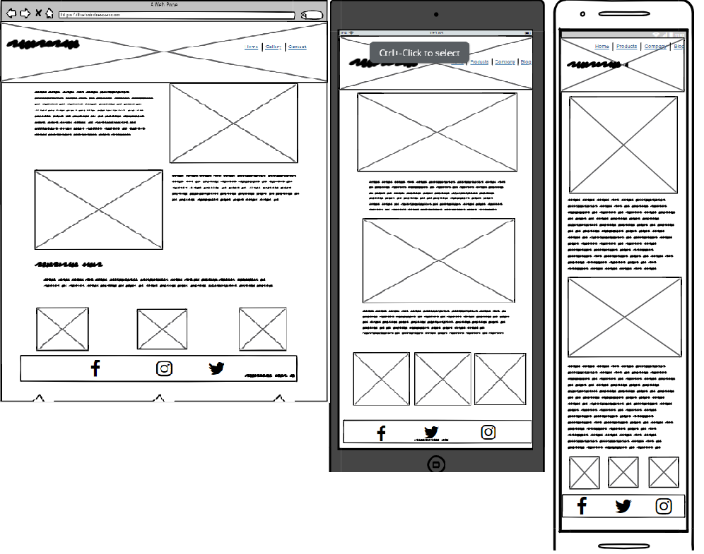

# The Hair Master

[Live webpage](https://r-moruju.github.io/CI_PP1_TH/index.html)

## Table of Content

1. [Project Goals](#project-goals)
    1. [User Goals](#user-goals)
    2. [Site Owner Goals](#site-owner-goals)
2. [User Experience](#user-experience)
    1. [Target Audience](#target-audience)
    2. [User Requrements and Expectations](#user-requrements-and-expectations)
    3. [User Stories](#user-stories)
3. [Design](#design)
    1. [Design Choices](#design-choices)
    2. [Colour](#colours)
    3. [Fonts](#fonts)
    4. [Structure](#structure)
    5. [Wireframes](#wireframes)
4. [Technologies Used](#technologies-used)
    1. [Languages](#languages)
    2. [Frameworks & Tools](#frameworks-&-tools)
5. [Features](#features)
6. [Testing](#validation)
    1. [HTML Validation](#HTML-validation)
    2. [CSS Validation](#CSS-validation)
    3. [Accessibility](#accessibility)
    4. [Performance](#performance)
    5. [Device testing](#performing-tests-on-various-devices)
    6. [Browser compatibility](#browser-compatability)
    7. [Testing user stories](#testing-user-stories)
8. [Bugs](#Bugs)
9. [Deployment](#deployment)
10. [Credits](#credits)
11. [Acknowledgements](#acknowledgements)

## Project Goals 

### User Goals
- Finding a barber shop that offers a nice atmosphere and good services.
- See service prices and opening hours.
- Find information about the barber shop.
- Find the location of the barber shop

### Site Owner Goals
- Increase in the number of customers.
- Promote the bussines.
- Provide a way for new and existing customers to contact the buissnes.
- Provide essential information about the bussines to customers.

## User Experience

### Target Audience
- People looking for a place to get ther hair cut
- People looking for the latest haircut techniques
- People looking for current fashion in haircuts

### User Requrements and Expectations

- A simple and intuitive navigation system
- Quickly and easily find relevant information
- Links and functions that work as expected
- Good presentation and a visually appealing design regardless of screen size
- An easy way to contact the bussines
- Simple content that the user can skim read
- Accessibility

### User Stories

#### First-time User 
1. As a first time user, I want to know where the barber shop is lokated
2. As a first time user, I want to know the price range
3. As a first time user, I want to know more about the barber shop
4. As a first time user, I want to get a feel of what to expect at the barber shop

#### Returning User
5. As a returning user, I want to see examples of haircuts
6. As a returnign user, I want to know the opening times
7. As a returning user, I want to find a phone number to call for reservation
8. As a returning user, I want to see other customers reviews
9. As a returning user, I want to leave some comment, suggestion or message to the staff
10. As a returning user, I want to find the barber shop on social media
11. As a returning user, I want to get directions to the restaurant

#### Site Owner 
13. As the site owner, I want users to find news about upcoming events or changes in opening times
14. As the site owner, I want users to get to know the barber shop 
15. As the site owner, I want the users to be able to contact us

## Design

### Design Choices
Considering that the website will be mostly visited by men, a simple and straightforward design has been adopted, with little attention to details. Today's men have a full life and little time to waste, so they want to be able to cut their hair without wasting time, while keeping up with fashion.

### Wireframes

Home

About

Gallery

Contact

## Features

This a simple website for a local barber shop made using only HTML5 and CSS3 languages.

The purpose of this site is to provide users with more information about this business and for this business to have an additional online presence outside of social media networks, reaching more users and expanding its customer base.

Nothing complicated. A simple strategy has been adopted, thus ensuring that the user will not have any problems in easily navigating around the website.

- __Navigation Links__

    - It has a presence on all three pages, will always contain links to all pages and highlights the current page.
    - The user can use it to navigate around website, and thanks to highlight feature he will always know the current page and never feel lost.

- __Header__

    - The header background image will tell the user exactly what is this site about from the first look at the page.
    - The same header background image is carried across all pages to ensure user that he is browsing the same website.

- __About Section__

    - This section contains a brief description of the business, such as staff experience and skills, and provides the user with an inside image of the shop.

- __Opening hours and Services__

    - Provides information about opening times for each day of the week, and is presenting a list of the services available plus the cost for each service.

- __Address Section__

    - Clearly shows to the user the shop address. It also contains a Google map window that the user can use to get directions to the shop.

- __Footer__

    - Provides external links to this shop social media profiles, where user can find more information about this  shop.
    - These links, when clicked, open in new tabs or windows.

- __Contact Page__

    - It provide the shop telephone number for the user.
    - A contact form is present here that the user can use to leave a message and his contact details to be contacted by the shop.